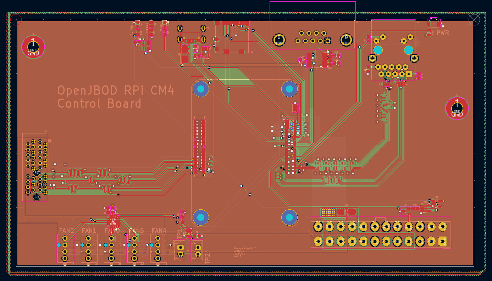
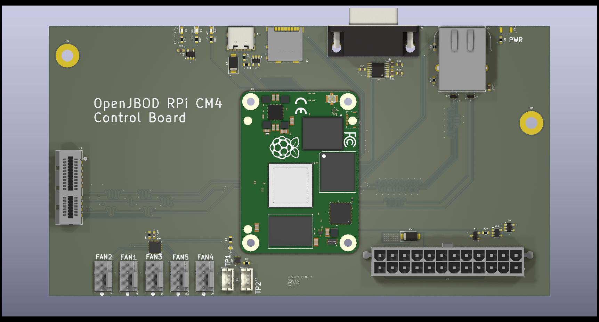
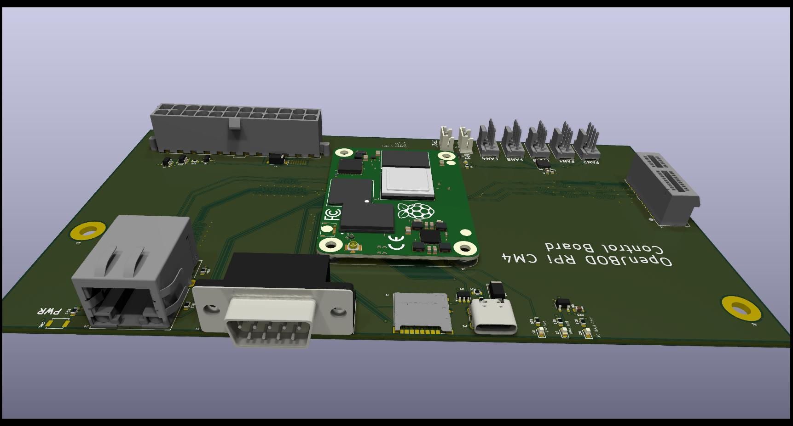
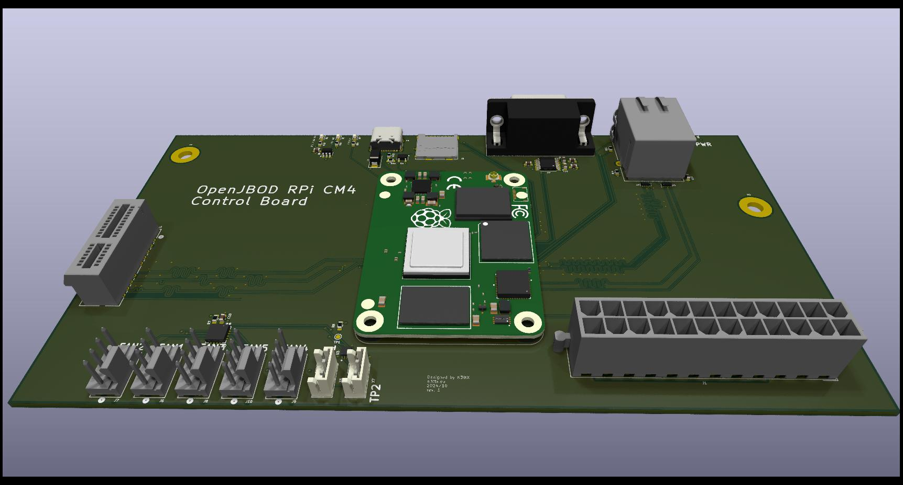

# Raspberry Pi CM4 OpenJBOD Controller

This project is heavily inspired by the work of [TheGuyDanish](https://github.com/openjbod/rp2040), specifically his [OpenJBOD](https://github.com/OpenJBOD) thingamajig.

It aims to provide much more "hackable" and robust way to to what OpenJBOD aims to do.

You can preview the schematics [in .pdf here](docs/CM4_JBOD_Control_Board.pdf)

## Images

# KiCAD libraries

Since I am not sure how to properly export my global libraries to the project, and I am too lazy to be bothered by changing the references individually, I have provided the entire "Custom_Libs" folder that I have on my computer. Some footprints or whatever might not be used in this project, you can safely ignore those. Adding this folder to library path should be enough for KiCAD to then locate all necessary symbols, footprints and 3D models. If not, you can link them manually. I might fix this sometime in the future maybe.

--- TBA ---
